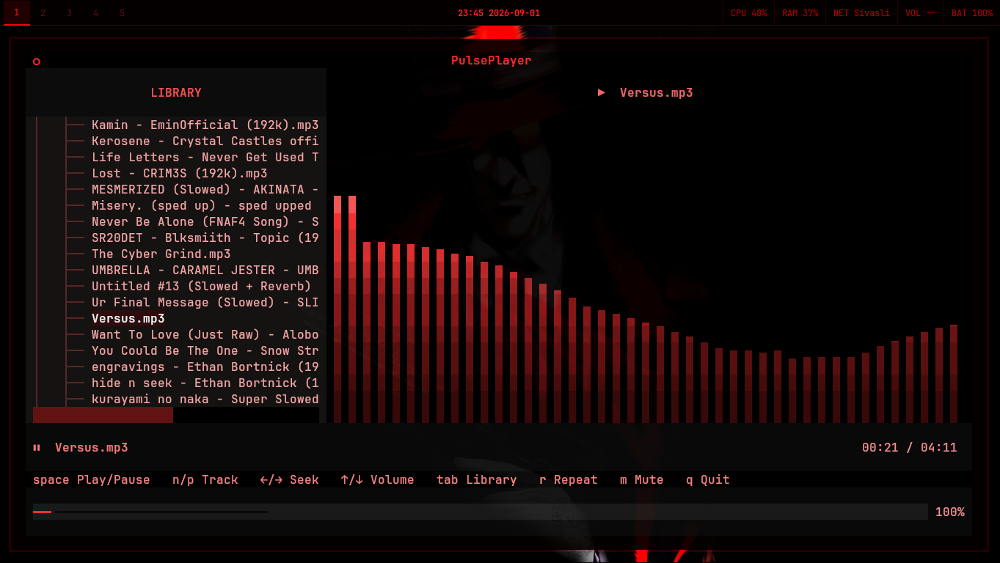
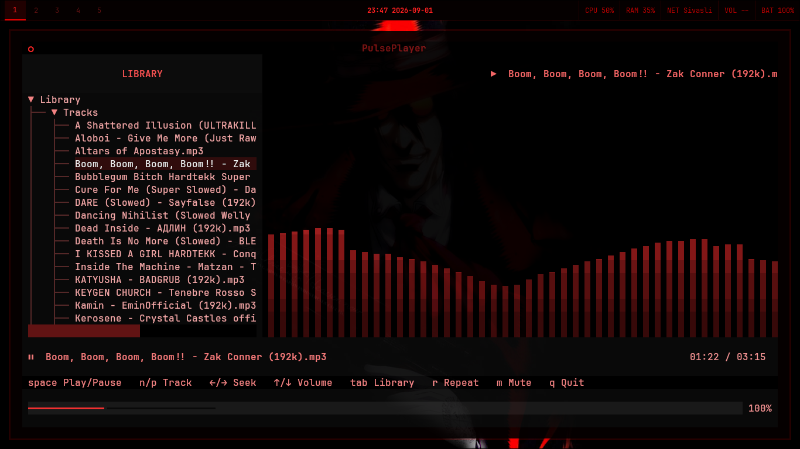

# PULSE

### A terminal-native music player with a heartbeat.

**PULSE** is a lightweight, keyboard-driven TUI music player built with
**Python**, **Textual**, **mpv**, and **CAVA**.

It is designed around a simple idea: local music playback should feel
fast, focused, and look ridiculously good in a terminal.





------------------------------------------------------------------------

## ✦ Features

-   Local music playback powered by **mpv**
-   Recursive music-library scanning
-   Tree-based library browser
-   Track and album views
-   Real-time **CAVA** spectrum visualizer
-   Custom red-on-black terminal theme
-   Fully keyboard-driven controls
-   Playlist repeat
-   Mute support
-   Volume control up to 130%
-   Instant seeking
-   Works beautifully with minimalist terminal setups
-   Lightweight UI with no unnecessary graphical chrome

PULSE currently supports common formats including:

`MP3` · `FLAC` · `OGG` · `OPUS` · `M4A` · `AAC` · `WAV` · `WMA` · `AIFF`
· `APE` · `MP4` · `MKA`

------------------------------------------------------------------------

##  Requirements

PULSE is currently aimed at Linux systems with:

-   Python 3.10+
-   `mpv`
-   `cava`
-   PulseAudio / PipeWire audio output
-   Python packages:
    -   `textual`
    -   `rich`
    -   `python-mpv`

If you're using PipeWire, the included CAVA configuration uses its
PipeWire input backend.

------------------------------------------------------------------------

##  Installation

Clone the repository:

``` bash
git clone https://github.com/yourusername/pulse.git
```
``` bash
cd pulse
```

Install the Python dependencies:

``` bash
pip install textual rich python-mpv
```

Make sure the system dependencies are installed.

### Arch Linux

``` bash
sudo pacman -S mpv cava
```

### Debian/Ubuntu Systems

``` bash
sudo apt install mpv cava
```

Then start PULSE:

``` bash
python main.py
```

By default, PULSE scans:

``` text
~/Music
```

You can also specify another directory:

``` bash
python main.py ~/Music/Soundtracks
```

------------------------------------------------------------------------

##  Controls

  Key       Action
  --------- ------------------------
  `Space`   Play / Pause
  `N`       Next track
  `P`       Previous track
  `← / →`   Seek −/+ 10 seconds
  `↑ / ↓`   Volume −/+ 5%
  `Tab`     Toggle library
  `R`       Toggle playlist repeat
  `M`       Mute / Unmute
  `Q`       Quit

The controls are also displayed inside the UI, so you don't have to
memorize anything.

------------------------------------------------------------------------

##  Design

PULSE follows a deliberately restrained visual language:

-   **Black** background
-   **Deep red** UI elements
-   Bright red highlights
-   Monospace typography
-   Minimal borders and panels
-   Subtle background imagery
-   Real-time spectrum visualization

The visualizer reads raw 16-bit bar data from CAVA and applies temporal
smoothing before rendering the spectrum through Textual.

That means the bars aren't just a static decoration --- they're actually
reacting to the audio.

------------------------------------------------------------------------

##  Architecture

PULSE keeps the playback engine and UI relatively separate:

``` text
                 ┌───────────────┐
                 │    Textual    │
                 │      TUI      │
                 └───────┬───────┘
                         │
              ┌──────────┴──────────┐
              │                     │
        ┌─────▼─────┐        ┌──────▼──────┐
        │    mpv    │        │    CAVA     │
        │ Playback  │        │ Visualizer  │
        └───────────┘        └─────────────┘
              │                     │
              └──────────┬──────────┘
                         ▼
                    Audio output
```

### Playback

`python-mpv` provides the playback engine and exposes properties such
as:

-   `time-pos`
-   `duration`
-   `pause`
-   `volume`
-   `mute`
-   `eof-reached`

Callbacks are marshalled back onto Textual's main thread so UI updates
stay thread-safe.

### Visualizer

CAVA runs as a subprocess with:

-   64 frequency bars
-   30 FPS
-   PipeWire input
-   raw binary output
-   16-bit bar values

PULSE reads the binary stream on a background thread and applies
attack/decay smoothing before rendering it.

------------------------------------------------------------------------

##  Project Structure

A minimal installation looks like:

``` text
pulse/
├── main.py
├── pulse.tcss
└── assets/
    ├── pulse-library.png
    └── pulse-visualizer.png
```

------------------------------------------------------------------------

##  Configuration

The default music directory is:

``` python
DEFAULT_DIR = Path.home() / "Music"
```

You can override it from the command line:

``` bash
python main.py /path/to/music
```

The visualizer is configured directly by PULSE when it starts CAVA, so
there is no separate CAVA configuration file to maintain.

You're also free to modify `pulse.tcss` to add your own colors. I will 
implement more colors and maybe even matugen/wallust support in later Versions.

------------------------------------------------------------------------

##  Status

**PULSE V1.1 --- Complete**

V1.1 brings:

-   Redesigned UI layout
-   Improved library presentation
-   Refined now-playing area
-   Improved CAVA spectrum rendering
-   Temporal visualizer smoothing
-   Red spectrum gradient
-   Better playback/status presentation
-   Library toggle support
-   Album tree support

------------------------------------------------------------------------

##  Roadmap

Possible future additions:

-   [ ] Search
-   [ ] Metadata display
-   [ ] Playlists
-   [ ] Queue management
-   [ ] Shuffle
-   [ ] Config file
-   [ ] Persistent volume / playback state
-   [ ] More visualizer modes
-   [ ] Installable CLI command
-   [ ] Settings menu

------------------------------------------------------------------------

##  License

PULSE is licensed under the MIT License.

You are free to use, copy, modify, merge, publish, distribute,
sublicense, and sell the software, subject to the conditions of the
license.

See LICENSE for the full license text.

SPDX-License-Identifier: MIT

------------------------------------------------------------------------

:::
**PULSE**

*Local music. No subscriptions. No nonsense.*

`V1.1`
:::
