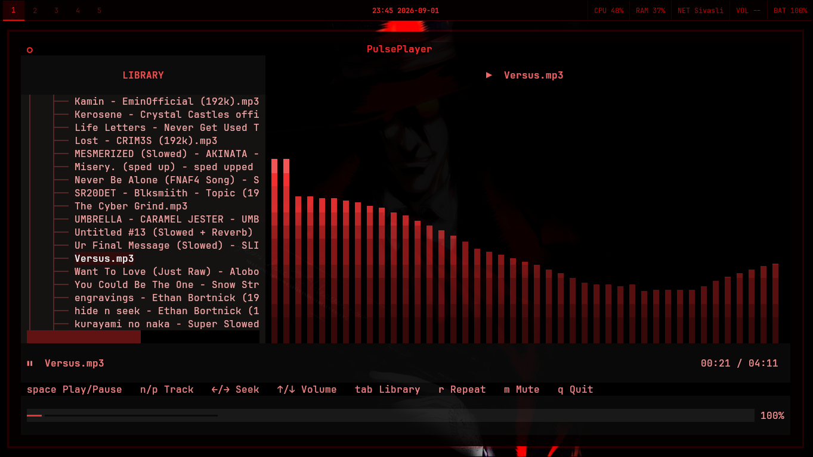
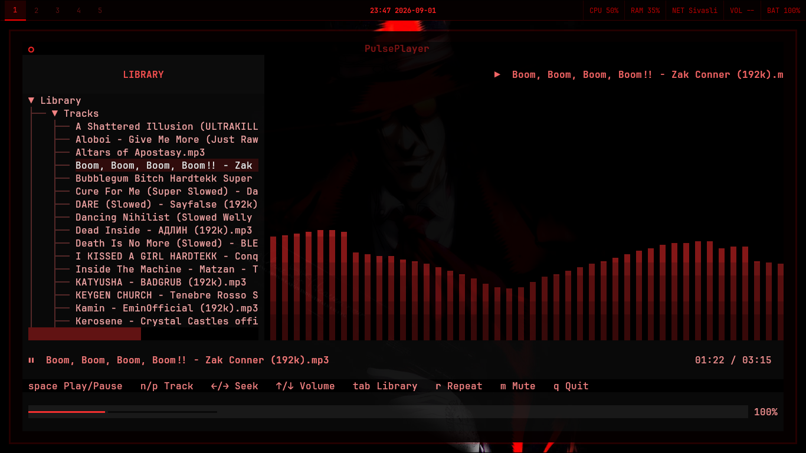

# PULSE

### A terminal-native music player with a heartbeat.

**PULSE** is a lightweight, keyboard-driven TUI music player built with
**Python**, **Textual**, **mpv**, and **CAVA**.

It is designed around a simple idea: local music playback should feel
fast, focused, and look ridiculously good in a terminal.





------------------------------------------------------------------------

## ✦ Features

-   Local music playback powered by **mpv**
-   Recursive music-library scanning
-   Tree-based library browser
-   Track and album views
-   Real-time **CAVA** spectrum visualizer (toggle with `V`), degrades
    gracefully when `cava` is not installed
-   Native **Nix** support: `nix run`, a NixOS/Home Manager module, and a dev
    shell
-   Starts paused, so PULSE never interrupts you on launch
-   Custom red-on-black terminal theme
-   Fully keyboard-driven controls
-   Playlist repeat
-   Mute support
-   Volume control up to 130%
-   Instant seeking
-   Works beautifully with minimalist terminal setups
-   Lightweight UI with no unnecessary graphical chrome

PULSE currently supports common formats including:

`MP3` · `FLAC` · `OGG` · `OPUS` · `M4A` · `AAC` · `WAV` · `WMA` · `AIFF`
· `APE` · `MP4` · `MKA`

------------------------------------------------------------------------

##  Requirements

PULSE is currently aimed at Linux systems with:

-   Python 3.10+
-   `mpv` (including `libmpv`)
-   `cava` (optional, only for the visualizer)
-   PulseAudio / PipeWire audio output
-   Python packages:
    -   `textual`
    -   `rich`
    -   `python-mpv`

If you're using PipeWire, the included CAVA configuration uses its
PipeWire input backend.

------------------------------------------------------------------------

##  Installation

### Nix

Everything comes from nixpkgs, including Python:

``` bash
git clone https://github.com/yourusername/pulse.git
cd pulse

nix run .            # play ~/Music
nix run . -- ~/Music/Soundtracks
```

Install it permanently:

``` bash
nix profile install .
```

Or build it and put the result somewhere you can run by hand:

``` bash
nix build
./result/bin/pulse
```

For hacking on it:

``` bash
nix develop          # python3 + mpv + cava, no venv needed
python main.py
nix flake check      # tests: PULSE starts, finds libmpv, toggles cleanly
nix fmt              # format the Nix files
```

The tests run without Nix too, as long as the dependencies are importable:

``` bash
python tests/test_smoke.py
```

One thing to know: Nix reads flakes from git, so it only sees tracked
files. Edits to files that are already tracked are picked up, but a brand new
file is invisible until you `git add` it, and Nix warns
`Git tree ... is dirty` whenever you have uncommitted changes.

#### NixOS

Add PULSE to your configuration, usually as a flake input:

``` nix
{
  inputs.pulse.url = "github:yourusername/pulse";

  # ...

  outputs = { nixpkgs, pulse, ... }: {
    nixosConfigurations.laptop = nixpkgs.lib.nixosSystem {
      system = "x86_64-linux";
      modules = [
        pulse.nixosModules.default
        {
          programs.pulse.enable = true;
          # optional, defaults to ~/Music
          programs.pulse.musicDir = "/srv/music";
        }
      ];
    };
  };
}
```

Without flakes, import the module straight from a checkout:

``` nix
{
  imports = [ /path/to/pulse/nix/module.nix ];

  programs.pulse.enable = true;
}
```

#### Home Manager

Same options, different module:

``` nix
{
  imports = [ pulse.homeManagerModules.default ];

  programs.pulse.enable = true;
  programs.pulse.musicDir = "/srv/music";
}
```

#### Why PULSE needs a wrapper on Nix

Nix stores every library in its own store path, so `libmpv.so.2` is not in
the loader cache. python-mpv loads it through `ctypes.util.find_library`,
which only knows about `ldconfig` and `ld`; on Nix both come up empty and
PULSE used to die at import time with a bare "cannot find libmpv".

The wrapper handles that:

-   `LD_LIBRARY_PATH` points at mpv's `lib`, so `find_library` succeeds
-   `mpv` and `cava` go on `PATH`
-   `programs.pulse.musicDir` becomes `$PULSE_MUSIC_DIR`

PULSE also does its own best-effort discovery of libmpv at startup, so
`python main.py` works inside `nix develop` and in a plain virtualenv too.

### Arch Linux

``` bash
sudo pacman -S mpv cava
```

### Debian/Ubuntu Systems

``` bash
sudo apt install mpv cava
```

### From source, everywhere else

Clone the repository:

``` bash
git clone https://github.com/yourusername/pulse.git
cd pulse
```

Install the Python dependencies:

``` bash
pip install textual rich python-mpv
```

Make sure the system dependencies are installed, then start PULSE:

``` bash
python main.py
```

By default, PULSE scans:

``` text
~/Music
```

You can also specify another directory:

``` bash
python main.py ~/Music/Soundtracks
```

------------------------------------------------------------------------

##  Environment variables

PULSE reads a few environment variables, which is what the Nix module uses to
configure the wrapper:

| Variable | Purpose |
| --- | --- |
| `PULSE_MUSIC_DIR` | Default music directory, used when no directory is passed |
| `PULSE_AO` | Force an mpv audio output (`pipewire`, `pulse`, `alsa`, `null`) |
| `PULSE_LIBMPV` | Path to `libmpv.so.2`, for setups where discovery fails |
| `XDG_RUNTIME_DIR` | Filled in from `/run/user/$UID` when unset, so PipeWire and PulseAudio sockets are found |

Without `PULSE_AO`, PULSE asks mpv which outputs it supports and prefers
PipeWire, then PulseAudio, then ALSA.

------------------------------------------------------------------------

##  Controls

  Key       Action
  --------- ------------------------
  `Space`   Play / Pause
  `N`       Next track
  `P`       Previous track
  `← / →`   Seek −/+ 10 seconds
  `↑ / ↓`   Volume −/+ 5%
  `Tab`     Toggle library
  `V`       Show / hide visualizer
  `R`       Toggle playlist repeat
  `M`       Mute / Unmute
  `Q`       Quit

The controls are also displayed inside the UI, so you don't have to
memorize anything.

`Tab` and `V` can be combined freely --- hiding the library widens the
now-playing area to the full row, and hiding the visualizer gives the track
title the whole pane. Toggling either one repeatedly always lands back on the
same layout.

PULSE always opens with the library loaded but **paused** --- the first
track is selected and ready, but nothing plays until you press `Space`.

------------------------------------------------------------------------

##  Design

PULSE follows a deliberately restrained visual language:

-   **Black** background
-   **Deep red** UI elements
-   Bright red highlights
-   Monospace typography
-   Minimal borders and panels
-   Subtle background imagery
-   Real-time spectrum visualization

The visualizer reads raw 16-bit bar data from CAVA and applies temporal
smoothing before rendering the spectrum through Textual.

That means the bars aren't just a static decoration --- they're actually
reacting to the audio.

------------------------------------------------------------------------

##  Architecture

PULSE keeps the playback engine and UI relatively separate:

``` text
                 ┌───────────────┐
                 │    Textual    │
                 │      TUI      │
                 └───────┬───────┘
                         │
              ┌──────────┴──────────┐
              │                     │
        ┌─────▼─────┐        ┌──────▼──────┐
        │    mpv    │        │    CAVA     │
        │ Playback  │        │ Visualizer  │
        └───────────┘        └─────────────┘
              │                     │
              └──────────┬──────────┘
                         ▼
                    Audio output
```

### Playback

`python-mpv` provides the playback engine and exposes properties such
as:

-   `time-pos`
-   `duration`
-   `pause`
-   `volume`
-   `mute`
-   `eof-reached`

Callbacks are marshalled back onto Textual's main thread so UI updates
stay thread-safe.

### Visualizer

CAVA runs as a subprocess with:

-   64 frequency bars
-   30 FPS
-   PipeWire input
-   raw binary output
-   16-bit bar values

PULSE reads the binary stream on a background thread and applies
attack/decay smoothing before rendering it.

Pressing `V` hides the spectrum. Hiding it also stops the CAVA
subprocess and pauses the render timer, so the visualizer costs nothing
while it is off --- press `V` again to bring it back.

The spectrum always fits the width it is given: bars are drawn with a
one-column gap, the count is capped to what fits, and the block is centred in
the leftover space. That is what makes it survive `Tab` --- the now-playing
pane alternates between 68% and 100% of the row, and the bars re-centre in
whichever box they get.

------------------------------------------------------------------------

##  Project Structure

A minimal installation looks like:

``` text
pulse/
├── main.py
├── pulse.tcss
├── flake.nix
├── nix/
│   ├── package.nix        # the derivation
│   ├── deps.nix           # shared Python environment
│   ├── source.nix         # store source, minus venv/results
│   ├── common.nix         # shared module options
│   ├── resolve.nix        # musicDir -> wrapper glue
│   ├── module.nix         # NixOS module
│   └── home-manager.nix   # Home Manager module
├── tests/
│   └── test_smoke.py     # libmpv discovery, audio output, layout, mount
└── assets/
    ├── pulse-library.png
    └── pulse-visualizer.png
```

------------------------------------------------------------------------

##  Configuration

The default music directory is:

``` python
DEFAULT_DIR = Path.home() / "Music"
```

You can override it from the command line:

``` bash
python main.py /path/to/music
```

The visualizer is configured directly by PULSE when it starts CAVA, so
there is no separate CAVA configuration file to maintain. If `cava` is not
installed, PULSE shows a short notice instead of a blank spectrum and the
rest of the player works normally.

You're also free to modify `pulse.tcss` to add your own colors. I will 
implement more colors and maybe even matugen/wallust support in later Versions.

------------------------------------------------------------------------

##  Status

**PULSE V1.2 --- Complete**

V1.2 brings:

-   Native Nix support: `nix run`, `nix build`, `nix profile install`
-   NixOS and Home Manager modules (`programs.pulse`)
-   Flake dev shell with mpv, CAVA and the Python dependencies
-   `libmpv` discovery that works on Nix, where the loader cache is empty
-   Automatic mpv audio output selection (PipeWire, PulseAudio, ALSA)
-   `XDG_RUNTIME_DIR` fallback so audio sockets are found
-   Visualizer degrades gracefully when `cava` is missing
-   Fixed the library toggle misaligning the visualizer: the width class
    landed on the inverted state, so showing the library again overflowed the
    now-playing pane and clipped the right edge of the spectrum
-   Smoke tests wired into `nix flake check`, including a regression test for
    the layout above

V1.1 brought:

-   Redesigned UI layout
-   Improved library presentation
-   Refined now-playing area
-   Improved CAVA spectrum rendering
-   Temporal visualizer smoothing
-   Red spectrum gradient
-   Better playback/status presentation
-   Library toggle support
-   Album tree support

------------------------------------------------------------------------

##  Roadmap

Possible future additions:

-   [ ] Search
-   [ ] Metadata display
-   [ ] Playlists
-   [ ] Queue management
-   [ ] Shuffle
-   [ ] Config file
-   [ ] Persistent volume / playback state
-   [ ] More visualizer modes
-   [x] Installable CLI command
-   [x] Nix packaging
-   [ ] Settings menu

------------------------------------------------------------------------

##  License

PULSE is licensed under the MIT License.

You are free to use, copy, modify, merge, publish, distribute,
sublicense, and sell the software, subject to the conditions of the
license.

See LICENSE for the full license text.

SPDX-License-Identifier: MIT

------------------------------------------------------------------------

:::
**PULSE**

*Local music. No subscriptions. No nonsense.*

`V1.2`
:::
